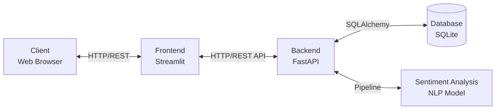
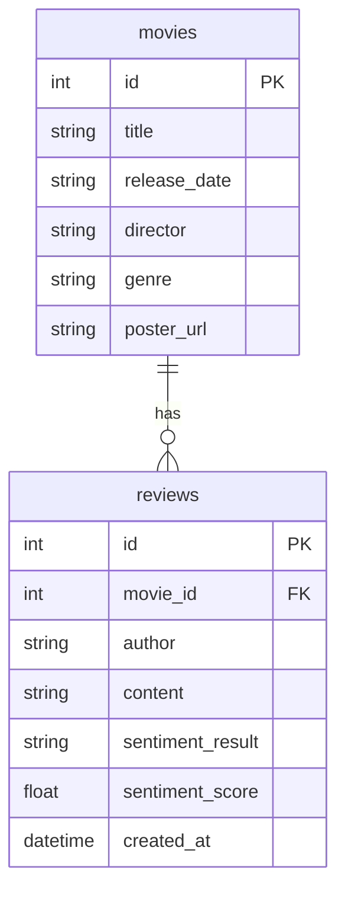
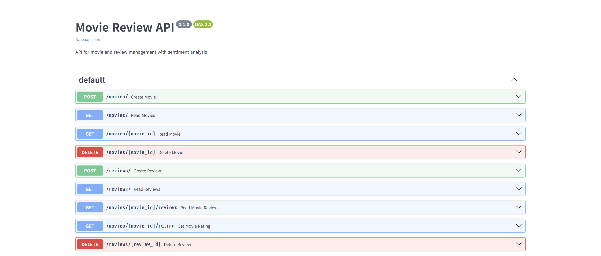
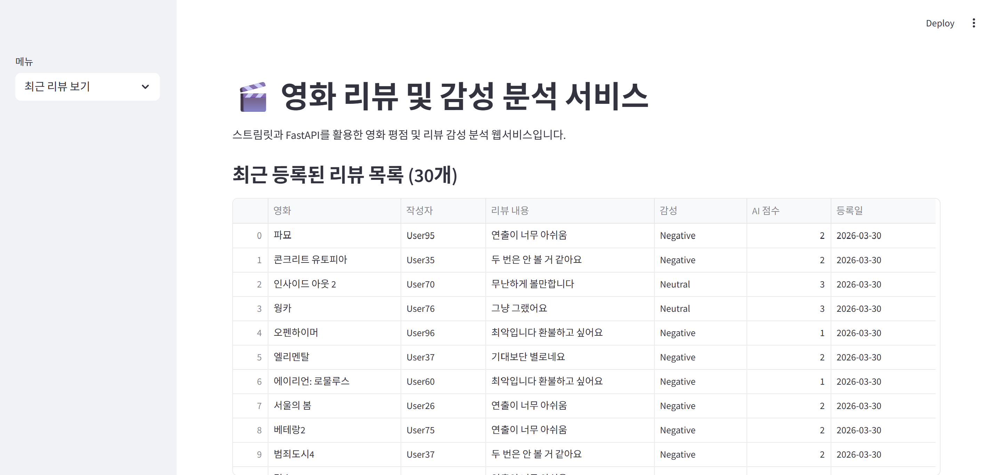

# [미션 18] 영화 리뷰 감성 분석 서비스 결과 보고서
**팀명/이름:** 7팀 김나연

## 1. 개요 (Service Overview)
본 서비스는 사용자가 영화 정보를 조회하고, 영화에 대한 리뷰를 남길 수 있는 웹 애플리케이션입니다. 
작성된 리뷰는 인공지능 모델을 통해 감성 분석(Positive, Neutral, Negative)이 진행되며, 이를 통해 영화의 전반적인 AI 평점을 자동으로 산출합니다.

**🔗 Streamlit 배포 링크:** [https://movie-sentiment-analyzer-a9e8hhdqfjq32dmkvxubqe.streamlit.app/](https://movie-sentiment-analyzer-a9e8hhdqfjq32dmkvxubqe.streamlit.app/)
*(배포 요구사항 수행 완료. 프론트엔드/백엔드 분리 아키텍처 특성상 실제 로컬 백엔드와의 API 통신 결과는 하단의 캡처 이미지로 증명합니다.)*

## 2. 서비스 구조도 (Architecture)

## 3. 프론트엔드, 백엔드 및 모델 서빙
- **Frontend (Streamlit)**: 간결한 파이썬 스크립트 기반의 웹 인터페이스 구성. 직관적인 화면(영화 목록, 영화 추가, 리뷰 작성, 최근 리뷰)을 제공합니다. (Streamlit Cloud 배포를 위한 환경 변수 지원 설정 적용 완료)
- **Backend (FastAPI)**: RESTful API를 빠르고 비동기적으로 처리하며, 데이터베이스 및 AI 감성 모델을 중계합니다. 리뷰 조회 및 삭제 기능 등 요구사항을 모두 충족하는 API가 세팅되어 있습니다.
- **Model Serving (Transformers)**: HuggingFace 기반의 다국어 감성 추론 모델(`nlptown/bert-base-multilingual-uncased-sentiment`)을 Backend에 통합했습니다.
- **(심화) 모델 경량화**: 애플리케이션 시작 단계에서 PyTorch의 **동적 양자화(Dynamic Quantization)** 기법(`torch.quantization.quantize_dynamic`)을 적용하여 `torch.nn.Linear` 레이어를 `qint8`로 압축했습니다. 메모리 사용량을 절감하면서도 CPU 상에서의 추론 속도를 높여 모델 경량화를 성공적으로 구현했습니다.

## 4. 데이터베이스 구조도 (ERD)

## 5. FastAPI Docs 전체 캡쳐 및 명세

**API 명세 설명**
- `POST /movies`: 새로운 영화 정보를 등록합니다.
- `GET /movies`: 등록된 전체 영화 목록을 조회합니다.
- `GET /movies/{movie_id}`: 특정 영화 상세 정보를 조회합니다.
- `DELETE /movies/{movie_id}`: 영화를 삭제합니다.
- `POST /reviews`: 리뷰를 등록합니다. 서버에서 리뷰 텍스트의 감성을 자동 분석하여 저장합니다.
- `GET /reviews`: 최근 작성된 리뷰들을 조회합니다.
- `GET /movies/{movie_id}/reviews`: 특정 영화의 리뷰만 필터링하여 조회합니다.
- `DELETE /reviews/{review_id}`: 단일 리뷰를 삭제합니다.
- `GET /movies/{movie_id}/rating`: 리뷰 분석 결과를 종합하여 영화의 평점(1~5점)을 반환합니다.

## 6. 서비스 동작 캡쳐 이미지
### 6.1 영화 3개 이상 등록 화면

### 6.2 각 영화당 리뷰 10개 이상 등록된 화면
